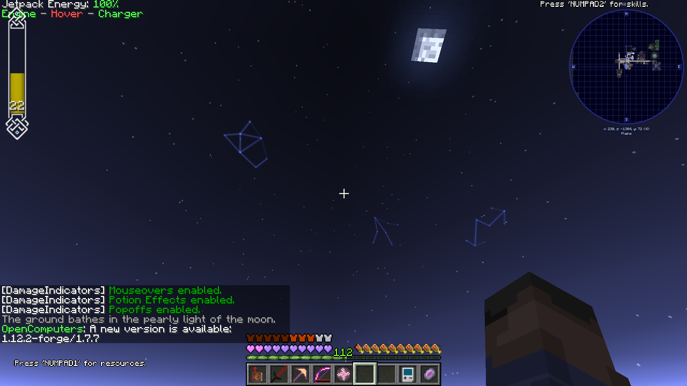
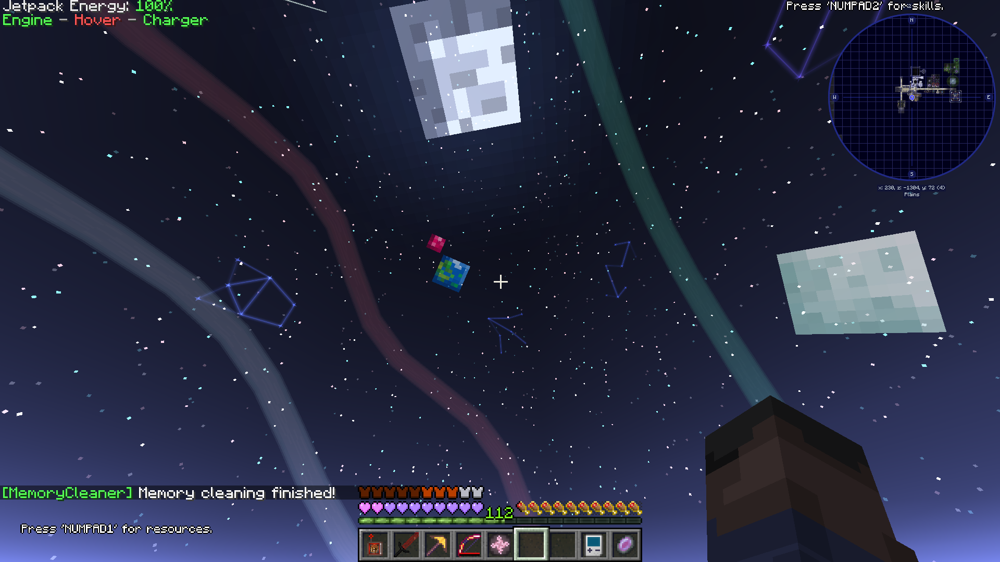

## **All credit goes to Vazkii for the original mod and other contributors that have kept the mod updated.**
### This fork is no longer necessary! Functionality has been adapted by [UniversalTweaks](https://github.com/ACGaming/UniversalTweaks)
  
Welcome to the Botania repository.  

Botania is a [Minecraft](https://minecraft.net/) mod based on adding natural magic to the game. It's inspired by other magic mods, such as [Thaumcraft](https://www.curseforge.com/minecraft/mc-mods/thaumcraft) or [Blood Magic](https://www.curseforge.com/minecraft/mc-mods/blood-magic).  

The current iteration of Botania for 1.10 is made possible thanks to the massive help by the part of williewillus, who ported the mod through 1.8, 1.9 and 1.10, so go buy him a beer or something, I dunno, he's pretty cool.

Botania is licensed under the [Botania License](http://botaniamod.net/license.php)
---
# Purpose of Fork (MC version 1.12)
This fork is a copy with the modified files used for a Minecraft modpack called [Meatballcraft](https://www.curseforge.com/minecraft/modpacks/meatballcraft) (MBC for short). All credit for the modpack goes to Sainagh, the pack creator. These are the exact files (to my knowledge) compiled and used in the modpack as of version "Meatballcraft-beta-0.12". The class files are available at Sainagh's modpack Github repo [here](https://github.com/sainagh/meatballcraft).

The modified files are injected into the original jar's class files using the mod patcher [Bansoukou](https://www.curseforge.com/minecraft/mc-mods/bansoko).

## Feature(s)
- Adds the Garden of Glass (GoG) skybox renderer to the Simple Void World, which is often used in the pack as a world to build one's main base.
- Adds a config option (`fancySkybox.simpleVoidWorlds`) to `botania.cfg` to enable/disable this skybox in the void world.

Disabled:

Enabled:

